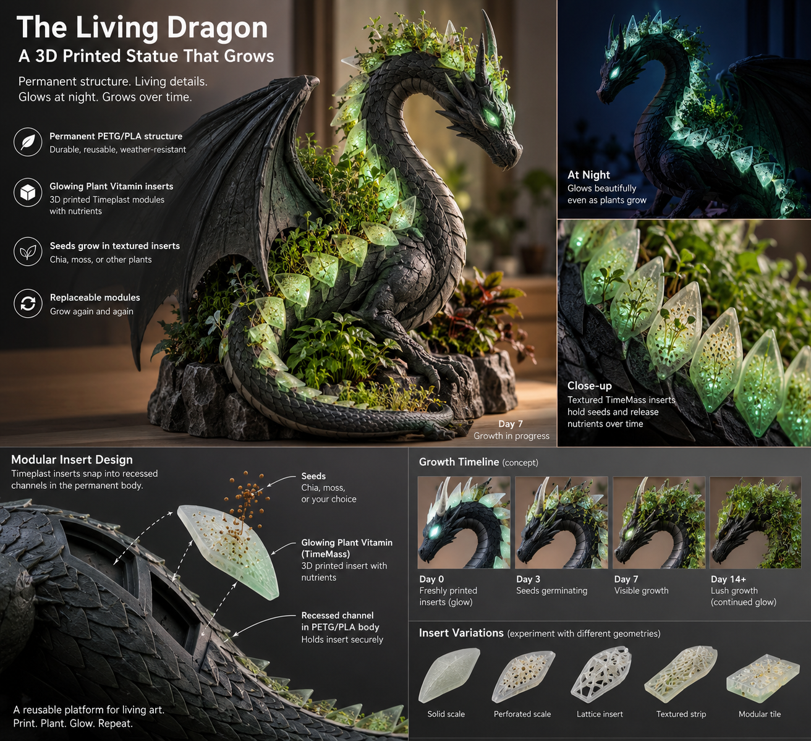

# Concept

## Visual reference

Kevin supplied the concept board below on 2026-09-07 in response to the pose question. It establishes the visual direction: an upright winged dragon, arched neck and lowered head, curled tail, and a rocky planted base. Pale leaf-shaped inserts trace the crest, back, and tail against a dark, scaled body.

The image is a concept reference, not a photograph of a validated build. Embedded captions describe proposed features. Growth dates, glow brightness, weather resistance, nutrient delivery, and illustrated snap fits are not measured results or fabrication specifications. The glowing eyes are a visual detail with no selected implementation.

## User direction

Kevin wants a large build and is leaning toward H2C for its plate size. Roughly two feet tall (609.6 mm) appeals to Kevin as a working target, but he is not committed to a final size. For initial proportions, interpret height as base-to-highest-point assembled height; this convention is a planning assumption. Base footprint, wingspan, and assembly splits remain open. A small interface coupon establishes fit without limiting final size.

## Design intent interpreted from the reference

- Retain a reusable structural dragon and planted base, with separately replaceable TimeMass inserts.
- Preserve the upright silhouette, arched neck, prominent wings, and curled tail.
- Place growth along the dorsal insert path and in the base while retaining a recognizable dragon silhouette.
- Explore recessed sockets or channels that support inserts during handling and watering.
- Compare solid, perforated, and lattice scale geometries before expanding to strips or tiles.

PETG remains the structural candidate. The board also mentions PLA; this is not a confirmed material change. The identified [TimeMass product](../profiles/timemass-glowing-plant-vitamin.md) still requires printing and exposure validation.

## Engineering proposals to evaluate

Consider separate base, torso, neck/head, wings, and tail sections for printing, assembly, and repair. Determine the actual splits from verified machine limits, print orientation, joints, and loaded stability. Keep the structural load path independent of experimental inserts.

Begin with a curved back segment holding three removable leaf-shaped inserts. This tests the reference's visible interface more directly than a generic flat block. Specify drainage and removal access, then compare fit, seed retention, water exposure, and glow. This prototype is proposed, not yet designed or printed.

Keep overall proportions adjustable. If size changes, reevaluate structural joints, stability, wall thickness, and insert clearances; do not uniformly scale a tested socket and assume the fit remains valid.

## Decisions to make

- Overall height, wingspan, footprint, intended location, and desired plant coverage.
- Structural section boundaries and joint design.
- Plant species and growth medium; the image's plant labels do not select a species.
- Watering, drainage, cleaning, and replacement approach.
- H2C nozzle, plate, feed path, and verified usable envelope.
- Measurable acceptance criteria for fit, growth, glow, and durability.
